# Local-chatbox

## I. Model sử dụng

[Meta-Llama-3.1-8B-Instruct-Q6_K_L](https://huggingface.co/bartowski/Meta-Llama-3.1-8B-Instruct-GGUF/blob/main/Meta-Llama-3.1-8B-Instruct-Q6_K_L.gguf)
[Llama-3.2-1B-Instruct-Q3_K_L](https://huggingface.co/bartowski/Llama-3.2-1B-Instruct-GGUF/blob/main/Llama-3.2-1B-Instruct-Q3_K_L.gguf)

## II. Postman API

### 1. POST

- Dùng URL: http://127.0.0.1:8000/generate-response
- Thêm 1 Header với nội dung sau:
    - **Key**: `Content-Type`
    - **Value**: `application/json`


- Tại Body, chọn `raw` và để kiểu `JSON` với format sau:

```js
{
    "session_id": <id>,
    "user_prompt": <nội dung gửi>
}
```


Kết quả được trả về theo kiểu `JSON`:

```js
{
    "session_id": <id>,
    "user_prompt": <nội dung đã gửi>,
    "response": <câu trả lời của model>,
    "context": [<lịch sử chat gần đây nếu có>]
}
```


- Trong trường hợp gửi sai format thì API sẽ trả về như sau với mã `422 Unprocesable Entity`:
```js
{
    "detail": "Invalid request format: The content must be a JSON object with 2 keys: 'session_id' and 'user_prompt'"
}
```


### 2. GET

- Dùng URL: http://127.0.0.1:8000/history/{session_id}
- Thêm 1 Header với nội dung sau:
    - **Key**: `Accept`
    - **Value**: `application/json`


- Kết quả trả về sẽ có dạng:

```js
{
    "session_id": <id>,
    "user_prompt": <nội dung đã gửi>,
    "response": <câu trả lời của model>,
    "context": []
}
```


### 3. DELETE

- Dùng URL: http://127.0.0.1:8000/delete-history/{session_id}
- Thêm 1 Header với nội dung sau:
    - **Key**: `Content-Type`
    - **value**: `application/json`


- Kết quả trả về có dạng:

```js
{
    "message": "Deleted <number of deleted chat> conservation(s) for session_id: <id>"
}
```


- Trong trường hợp không có `session_id` tương ứng có chứa nội dung đoạn thoại thì kết quả trả về sẽ như sau:


## III. Multilingual

Model sẽ tự động nhận diện ngôn ngữ sử dụng trong user_prompt nên người dùng đơn giản chỉ cần giao tiếp bằng ngôn ngữ mong muốn là được.
- Tiếng Anh:

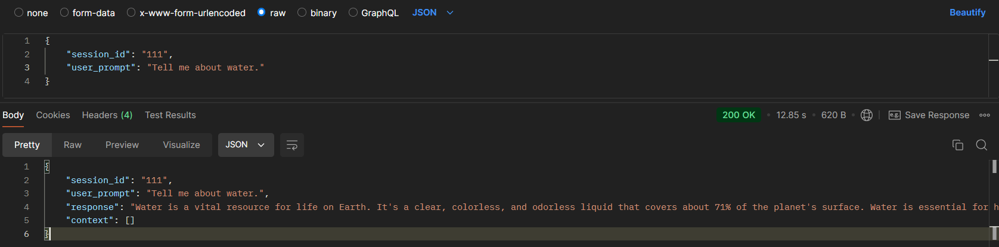

- Tiếng Việt:

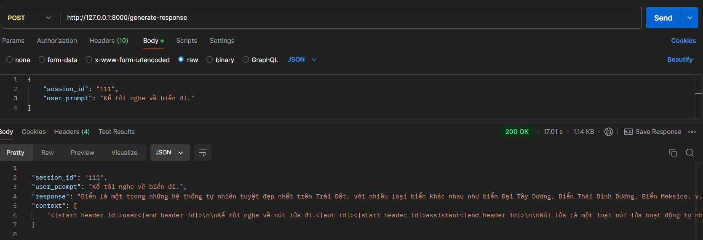

- Tiếng Đức:

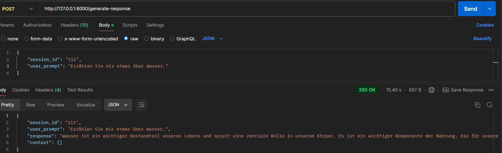

Ngoài ra có thể phiên dịch sang ngôn ngữ khác bằng cách chỉ định ngôn ngữ đầu ra:

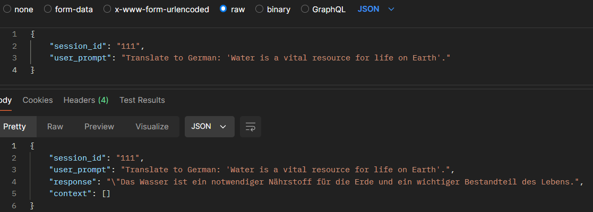

## IV. Docker

- Tạo file Dockerfile đặt cùng với folder project.
- Mở terminal lên, di chuyển tới folder project và chạy lệnh sau để build image:
`docker build -t local-chatbox`

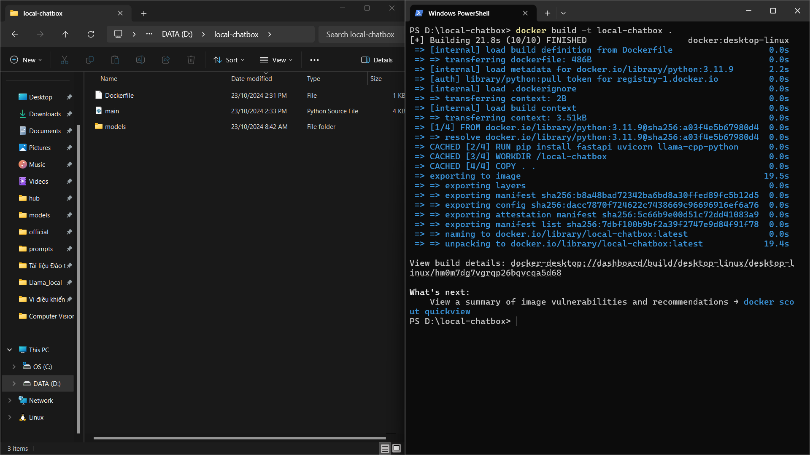

- Image đã được build xong.

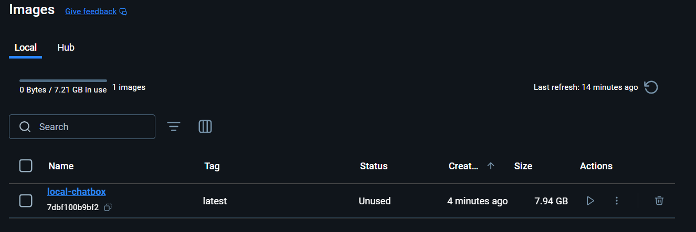

- Chạy image trên container với lệnh:
`docker run -d -p 8000:8000 local-chatbox`

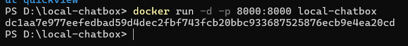

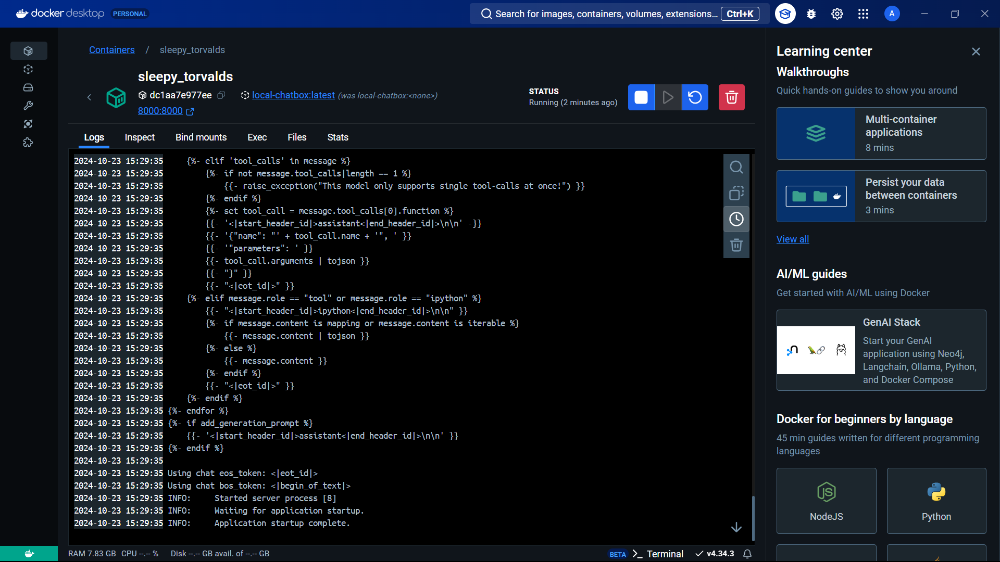

## V. Push image lên Dockerhub

- Tạo 1 repo mới trên Dockerhub

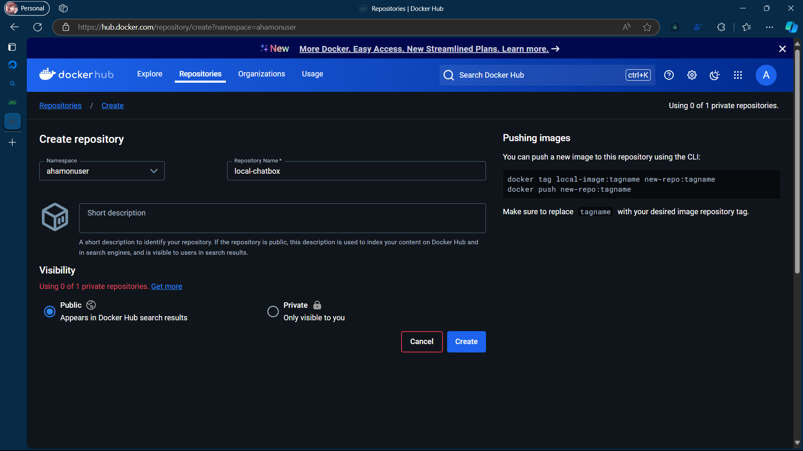

- Mở terminal lên, nếu trước đó chưa đăng nhập vào dockerhub thì dùng lệnh:

`docker login`

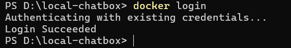

- Từ image local đã build, tiến hành gắn tag và push lên repo qua 2 lệnh sau:

`docker tag local-chatbox:latest ahamonuser/local-chatbox:latest`
`docker push ahamonuser/local-chatbox:latest`

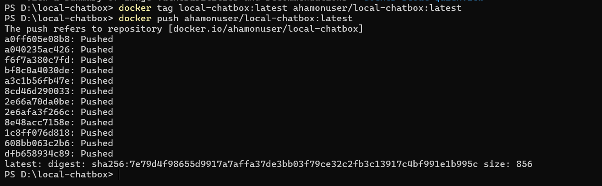

- Kiểm tra lại trên Docker-desktop và Dockerhub

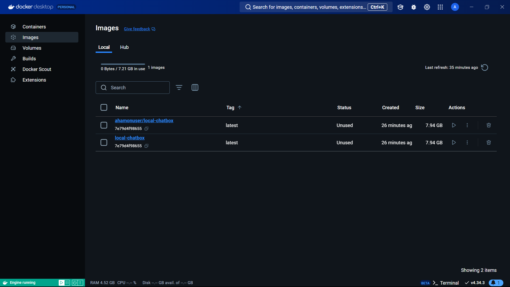

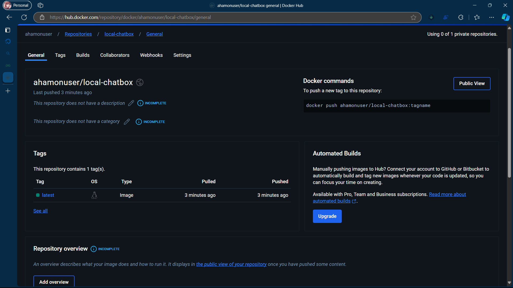

## VI. Flowchart

<div style="text-align:center">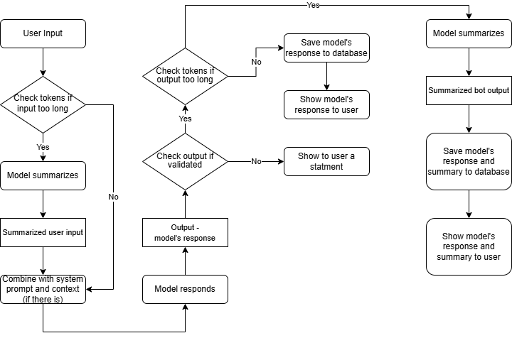</div>

